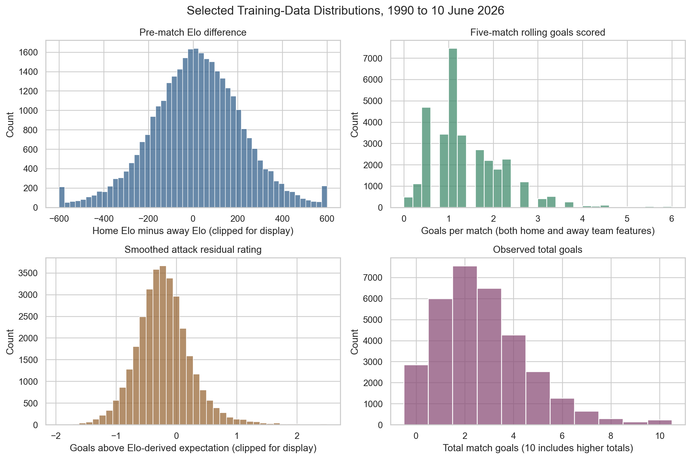
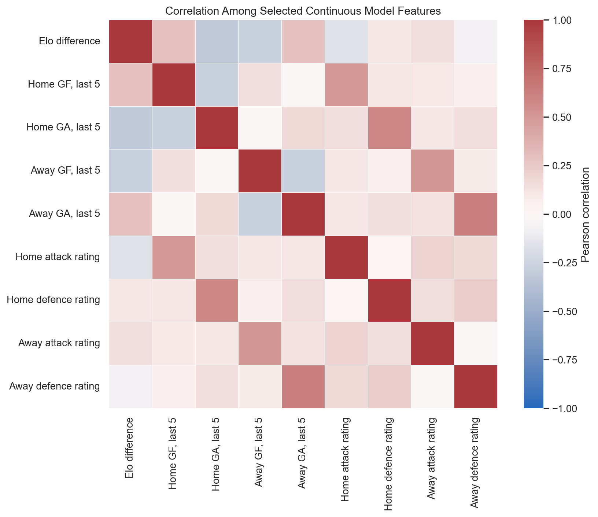
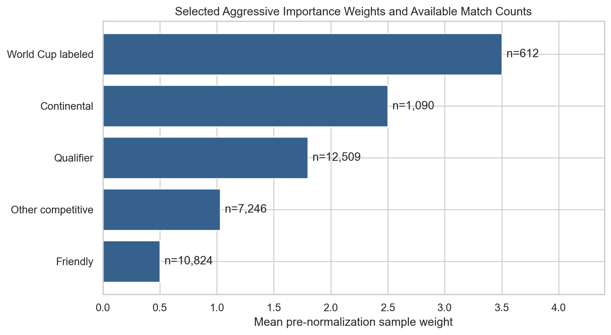
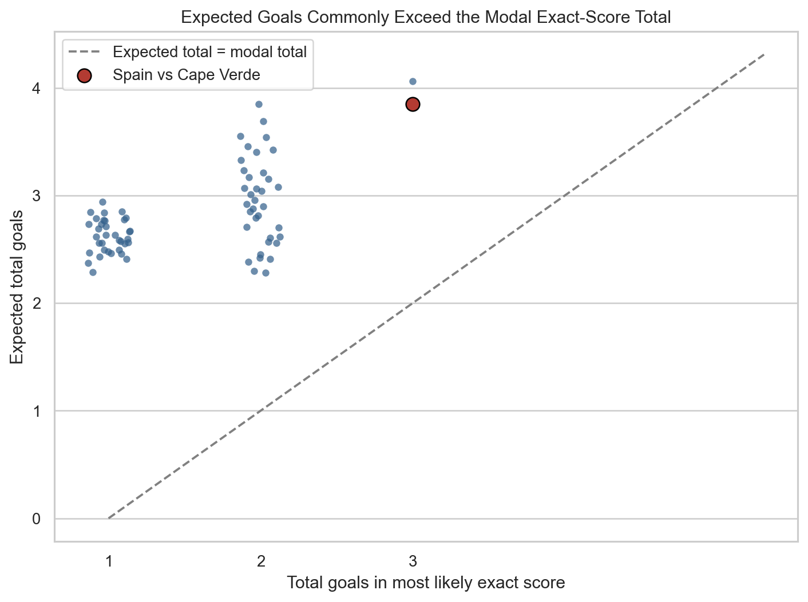
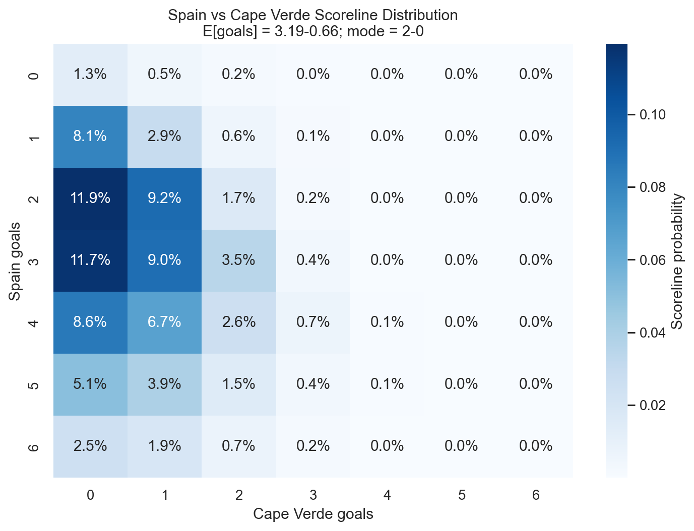

# A Leakage-Controlled Hybrid Elo-Poisson-Margin Framework for International Football Forecasting

## Technical Research Report

**Forecast snapshot:** 10 June 2026  
**Software:** `wc2026-predictor`, version 0.1.0  
**Primary application:** Pre-match forecasting and Monte Carlo simulation of the 2026 FIFA World Cup

## Abstract

This paper presents a reproducible framework for forecasting international football matches and simulating a complete tournament. The method combines dynamic Elo ratings, rolling pre-match performance features, separate Poisson regressions for home and away scoring rates, and a seven-class margin classifier. The Poisson models provide a coherent distribution over exact scores, while the margin classifier adjusts the distribution toward empirically improved home-win, draw, and away-win probabilities. All features are constructed chronologically and recorded before the corresponding match is used to update team state.

The model-selection procedure uses rolling, tournament-based backtests centered on the 2010, 2014, 2018, and 2022 World Cup periods. The selected margin-adjusted model achieved mean outcome log loss of 0.9617 and mean multiclass Brier score of 0.5654, compared with 0.9631 and 0.5669 for the unadjusted Poisson baseline. Its top-five exact-score hit rate was 55.5%. The improvement is small and should not be interpreted as decisive evidence of superiority. A data-label audit also found that the current 2010 test set includes 11 `Viva World Cup` matches in addition to 64 FIFA World Cup matches; consequently, the reported evaluation is not yet a perfectly isolated four-FIFA-World-Cup benchmark.

The framework's main practical advantage is that it retains one internally consistent scoreline distribution for match probabilities, expected goals, totals, clean sheets, and tournament simulation. The paper also clarifies why the most likely exact score can be lower than the expected total goals: the mode is a single scoreline cell, whereas expected goals average over the full right-skewed score distribution.

**Keywords:** football forecasting, expected goals, Poisson regression, Elo ratings, probabilistic forecasting, scoreline prediction, tournament simulation, World Cup

## 1. Introduction

Football forecasts are often communicated as a single predicted score. That representation is convenient but statistically incomplete. A match can have a most likely score of 2-0 while still having an expected total near four goals, because the single 2-0 outcome may be only slightly more probable than 3-0, 2-1, 3-1, or 4-0. For decision-making and tournament simulation, the relevant object is therefore not one scoreline but a probability distribution over all plausible scores.

This work develops a pre-match forecasting system for international football with three goals:

1. Estimate a coherent probability distribution over exact match scores.
2. Improve win, draw, and loss probabilities without discarding the score distribution.
3. Propagate match uncertainty through the complete 2026 World Cup format by Monte Carlo simulation.

The framework combines established statistical ideas with strict chronological feature construction. Elo ratings summarize long-run team strength. Poisson regressions estimate expected goals from ratings, recent scoring, and attack/defence state. A seven-class margin classifier estimates probabilities ranging from an away win by at least three goals to a home win by at least three goals. The margin output then reshapes the Poisson score matrix while preserving its useful within-outcome structure.

This paper describes the implemented method, reports its empirical evaluation, documents its limitations, and provides a reproducible research protocol. It is a technical report on a forecasting system, not a claim that the resulting probabilities are certain or suitable as gambling guarantees.

## 2. Contributions

The principal contributions are:

- A leakage-controlled feature pipeline in which Elo, rolling form, attack ratings, and defence ratings are captured before each match.
- A hybrid scoreline method that combines Poisson scoring intensity with a seven-class margin classifier.
- Outcome-level score-matrix reweighting that preserves the relative shape of scorelines within home-win, draw, and away-win regions.
- A staged chronological model-selection process designed to limit overfitting against a small number of tournament test periods.
- An exact implementation of the 48-team 2026 World Cup structure, including the conditional allocation of the eight best third-place teams.
- Explicit separation between expected goals and the modal exact score.
- A reproducibility-oriented audit of leakage risks, data-label issues, and rejected model extensions.

## 3. Data

### 3.1 Historical match data

The source file contains 49,472 international match records spanning 30 November 1872 through 27 June 2026. Matches after the forecasting cutoff are excluded before feature construction. The processed pre-match feature table contains 49,399 rows through 9 June 2026.

Production training uses matches from 1990 onward and through the inclusive cutoff of 10 June 2026. This produces 32,281 training rows involving 326 teams. The selected period contains 10,824 friendlies, 1,090 continental-competition matches, and 612 rows currently classified as World Cup matches.

The raw results are drawn from the maintained `martj42` international football results dataset. Team aliases are normalized through a manual mapping table. Unplayed rows and clear duplicate records are excluded, but surprising results and upsets are retained.

### 3.2 Tournament fixtures

The 2026 fixture representation contains 104 matches:

- 72 group-stage matches across 12 groups of four teams;
- 16 round-of-32 matches;
- 8 round-of-16 matches;
- 4 quarter-finals;
- 2 semi-finals;
- 1 third-place match; and
- 1 final.

The simulation validates that there are 48 unique group-stage teams and that all required advancement slots can be resolved. The conditional allocation of the eight best third-place teams is selected from FIFA's complete allocation table for each simulation.

### 3.3 Prediction snapshot

All reported 2026 forecasts use information available through 10 June 2026. The generated fixed-fixture match-prediction file contains the 72 known group-stage matchups. Knockout matchups are generated dynamically within each tournament simulation.

### 3.4 Exploratory feature distributions

Figure 1 summarizes several distributions from the 32,281-row production training sample. Elo difference is broad and approximately centered near an even matchup, while recent scoring, attack residuals, and observed total goals have visible right tails. These tails matter methodologically: deleting unusual matches would remove genuine information about mismatches, but fitting uncapped count targets would allow a very small number of extreme scores to exert disproportionate influence. The chosen compromise retains every match while capping only the goal-regression targets.



**Figure 1.** Selected training-data distributions from 1990 through the cutoff. Display clipping is used only for visualization. In the underlying data, 2.1% of matches have at least eight total goals and 0.9% have at least one team scoring more than the training cap of eight.

Figure 2 shows correlations among selected continuous features. Rolling scoring and residual attack/defence ratings are related but not interchangeable. For example, five-match home scoring correlates 0.50 with the home attack rating, while five-match away goals conceded correlates 0.63 with the away defence rating. The residual ratings therefore provide a smoother, expectation-adjusted memory of performance rather than merely repeating recent raw scores.



**Figure 2.** Pearson correlations among selected continuous features. Moderate rather than near-perfect correlations support retaining both short-window scoring and smoothed residual ratings.

## 4. Leakage Control and Chronological Design

Leakage control is central to the method. A football feature is valid only if it would have been known before kickoff.

For every calendar date, the pipeline first creates feature rows for all matches on that date. Only after all same-day features have been captured does it update Elo ratings, recent-form histories, and attack/defence state. This prevents an earlier-listed same-day match from affecting a later-listed same-day match.

The main controls are:

- Elo values are pre-match ratings.
- Rolling statistics exclude the current match.
- Same-day matches share only state available before that day.
- Training, validation, calibration, and backtesting splits are chronological.
- Matches after the forecast cutoff are excluded.
- Future-form targets are stored in a separate research table and never joined into same-match features.
- Extreme scores are retained as observations; only goal-model targets are capped for robust fitting.

## 5. Method

### 5.1 Elo team-strength model

Every team begins with rating 1500. For a non-neutral match, the designated home team receives a 65-point rating advantage. The expected home result is

$$
E_h = \frac{1}{1 + 10^{(R_a - R_h^*)/400}},
$$

where $R_a$ is the away rating and $R_h^* = R_h + 65$ for a non-neutral match or $R_h$ for a neutral match.

After the match, ratings are updated by

$$
R_h' = R_h + K_m G(d)(S_h - E_h),
$$

$$
R_a' = R_a + K_m G(d)(S_a - E_a),
$$

where $S$ is the observed result score, $K_m$ depends on match importance, and $G(d)$ is a capped goal-difference multiplier. Base K-factors are 20 for friendlies, 25 for qualifiers and default competitive matches, 30 for continental competitions, and 40 for FIFA World Cup matches. The selected training strategy scales standard Elo updates by 1.2.

The goal-difference multiplier is 1.0 for one-goal margins, 1.25 for two goals, 1.5 for three goals, and increases gradually up to a cap of 2.0 for larger margins.

### 5.2 Pre-match features

The selected goal and margin models use 22 features:

- pre-match home Elo, away Elo, and Elo difference;
- neutral-site, friendly, World Cup, continental, home-advantage, and host-country indicators;
- tournament importance;
- rolling goals scored and conceded over the previous five and ten matches for both teams; and
- smoothed attack and defence ratings for both teams.

Attack and defence ratings are exponentially updated residual measures. For example, a team's attack state is adjusted toward the difference between observed goals and Elo-derived expected goals, using learning rate 0.12.

Candidate challenger models also considered recent points, recent goal difference, rest days, opponent-adjusted form, and broader feature groups. Ablation tests found Elo to be the most important feature family. Recent form offered a smaller improvement, while several more complicated feature additions did not consistently improve frozen-period performance.

### 5.3 Match-importance weighting

The selected production strategy uses no time decay and applies aggressive match-importance weights. Before normalization to mean one, the profile assigns weights of 0.50 to friendlies, 1.20 to minor competitive matches, 1.80 to qualifiers, 2.50 to continental group matches, 3.00 to continental knockout matches, 3.50 to World Cup group matches, and 4.00 to World Cup knockout matches.

The weighting scheme addresses a domain mismatch. Friendlies are plentiful but may involve experimentation, unusual substitutions, and weaker incentives; World Cup matches are scarce but are the target domain. Weighting lets the model retain the broad information base without allowing friendlies to dominate the objective solely because of their count. Figure 3 shows this tradeoff directly.



**Figure 3.** Mean aggressive-profile weight and available match count by broad match type. World Cup-labeled matches receive seven times the friendly weight before weights are normalized to mean one.

The absence of time decay is an empirical selection, not an assumption that team strength never changes. Team change is already represented through Elo updates, rolling windows, and attack/defence states. Additional sample-level decay slightly worsened the tested backtests, possibly because it discarded useful cross-confederation and tournament information from a relatively sparse international schedule.

### 5.4 Poisson goal models

Separate regularized Poisson regressions estimate home and away expected goals. Let $\mathbf{x}$ denote the pre-match feature vector. The fitted scoring rates are

$$
\lambda_h = \exp(\beta_h^\top \mathbf{x}), \qquad
\lambda_a = \exp(\beta_a^\top \mathbf{x}).
$$

The implementation uses median imputation, standardization, and `PoissonRegressor` with regularization parameter $\alpha = 0.05$. Home and away goal targets are capped at eight during training. Predicted rates are constrained to the interval $[0.05, 5.5]$ when score matrices are created.

Assuming conditional independence, the initial exact-score probability is

$$
P(H=i,A=j)
=
\frac{e^{-\lambda_h}\lambda_h^i}{i!}
\frac{e^{-\lambda_a}\lambda_a^j}{j!}.
$$

The matrix covers scores from 0-0 through 10-10 and is normalized after truncation. Dixon-Coles low-score corrections were tested, but the selected value was $\rho=0$.

### 5.5 Seven-class margin model

The selected correction model is a multinomial logistic regression over seven goal-margin classes:

$$
\{-3\text{ or less}, -2, -1, 0, 1, 2, 3\text{ or more}\}.
$$

Although these classes have a natural order, the implemented classifier is multinomial and does not impose an ordinal-link constraint. Its class centers are

$$
\mathbf{c} = (-3,-2,-1,0,1,2,3).
$$

If $\mathbf{q}$ is the predicted seven-class probability vector, the expected margin is

$$
\delta = \mathbf{q}^{\top}\mathbf{c}.
$$

The baseline Poisson expected total,

$$
\tau = \lambda_h + \lambda_a,
$$

is combined with the expected margin to create provisional adjusted rates:

$$
\tilde{\lambda}_h = \frac{\tau+\delta}{2}, \qquad
\tilde{\lambda}_a = \frac{\tau-\delta}{2},
$$

with the same rate constraints applied. A new score matrix is then created from these adjusted rates.

The seven margin probabilities aggregate into target home-win, draw, and away-win probabilities:

$$
p_H = \sum_{k=1}^{3} P(\text{home wins by }k\text{ category}),
$$

$$
p_D = P(\text{draw}),
$$

$$
p_A = \sum_{k=1}^{3} P(\text{away wins by }k\text{ category}).
$$

### 5.6 Draw correction and score-matrix reweighting

The selected model applies a small draw multiplier that is strongest when teams have similar Elo ratings:

$$
m_D = 1 + (\alpha-1)\exp\left(-\frac{|\Delta Elo|}{180}\right),
$$

where $\alpha=1.01875$. The adjusted outcome probabilities are renormalized.

The score matrix is then partitioned into home-win, draw, and away-win regions. Every cell in a region is multiplied by the same factor so that the region's total probability equals the target outcome probability. This preserves relative scoreline probabilities within each outcome region while matching the margin model's aggregate outcome probabilities.

After reweighting, expected home and away goals are recomputed directly from the final matrix:

$$
\mathbb{E}[H] = \sum_{i,j} iP(i,j), \qquad
\mathbb{E}[A] = \sum_{i,j} jP(i,j).
$$

This final matrix is the shared source for exact scores, win/draw/loss probabilities, expected goals, over/under probabilities, both-teams-to-score probabilities, clean-sheet probabilities, and simulation draws.

### 5.7 Expected goals versus most likely score

The most likely score is the mode:

$$
(i^*,j^*) = \arg\max_{i,j} P(i,j).
$$

Expected goals are means over the complete distribution. These summaries answer different questions. The modal score may contain fewer goals than the expected total because many individually smaller high-score probabilities collectively create substantial upper-tail mass.

For example, the 10 June 2026 snapshot forecasts Spain versus Cape Verde as follows:

| Quantity | Forecast |
| --- | ---: |
| Spain expected goals | 3.194 |
| Cape Verde expected goals | 0.659 |
| Expected total goals | 3.853 |
| Most likely exact score | 2-0 |
| Probability of 2-0 | 11.9% |
| Spain win probability | 91.8% |
| Probability of over 2.5 goals | 75.1% |

Thus, `2-0` should not be read as a point prediction that Spain scores only twice. It is merely the largest individual scoreline cell.



**Figure 4.** Expected total goals versus the number of goals in the modal exact score for all 72 fixed 2026 group fixtures. Expected total goals are higher in every fixture, with a mean gap of 1.28 goals. In this snapshot, the pattern follows from the right-skewed score distributions and is not evidence that the forecasts contradict themselves.

Figure 5 makes the Spain-Cape Verde example concrete. The 2-0 cell is the largest at 11.9%, but 3-0 is nearly equal at 11.7%, and substantial probability remains across 2-1, 3-1, 4-0, and higher Spain scores. The mean therefore lies above the mode.



**Figure 5.** Final scoreline probabilities for Spain versus Cape Verde, limited to zero through six goals per team for readability.

### 5.8 Tournament simulation

Each simulated group-stage match is sampled from its final score matrix. Teams receive three points for a win and one for a draw. Group ranking uses points, goal difference, goals scored, and a random final tiebreaker.

The top two teams in each of 12 groups advance, along with the eight highest-ranked third-place teams. The round-of-32 allocation is resolved using the official conditional allocation table for the realized set of qualifying groups.

Knockout matches begin with a sampled regulation-time score. If tied, extra-time goals are independently sampled from Poisson distributions with rates equal to 35% of the corresponding regulation expected-goal rates. If still tied, penalty-win probability is based on the relative home/away win probabilities and clipped to the interval $[0.40,0.60]$.

The production simulation uses 10,000 tournament draws with deterministic base seed 42. Advancement probabilities are empirical frequencies across draws. The third-place fixture is retained in the official schedule representation but is not simulated because it does not affect advancement or championship probabilities.

### 5.9 Why these modeling choices were made

The final configuration was selected through a combination of statistical structure, domain reasoning, and frozen-period performance. Table 1 records the principal decisions and the alternatives they displaced.

| Choice | Why it was considered appropriate | Empirical evidence or tradeoff |
| --- | --- | --- |
| Start production training in 1990 | Retains four complete test periods while avoiding reliance on much older football regimes | Mean log loss was 0.9631 from 1990, versus 0.9650 from 1998 and 0.9678 from 2002 |
| Use Elo as the core strength representation | Elo is compact, chronological, interpretable, and available for nearly every team | Removing Elo worsened challenger log loss from 0.9737 to 1.0782 |
| Use standard Elo with K scale 1.2 | A slightly faster update responded better than the default scale without introducing a more complex rating system | Mean log loss was 0.9613 at scale 1.2, 0.9617 at 1.0, and 0.9804 for the best smoothed dynamic rating |
| Retain five- and ten-match scoring windows | Five matches represent short-run form; ten reduce variance and retain more context | Recent raw form improved challenger log loss by about 0.0051 |
| Retain residual attack/defence ratings | They smooth performance relative to opponent-adjusted expectation rather than only counting recent goals | Correlations with corresponding five-match raw features are moderate, approximately 0.50 to 0.63 |
| Fit separate home and away Poisson regressions | International matches exhibit asymmetric designated-home and away scoring environments; separate models retain that asymmetry | The attack/defence Poisson family produced the best tested goal-family log loss, 0.9631 |
| Cap training goal targets at eight | Protects the count-regression objective from rare extreme results while retaining those matches and all their features | Only 0.9% of production rows have either team score above eight; caps of six, eight, and ten performed similarly |
| Use an unadjusted Poisson dependence parameter, $\rho=0$ | Added low-score correction should earn its complexity empirically | Dixon-Coles variants at -0.05 and -0.10 worsened log loss to 0.9666 and 0.9696 |
| Add a seven-class margin classifier | It carries more structure than win/draw/loss while avoiding sparse exact-score classification | It improved mean log loss from 0.9631 to 0.9617 and top-five score coverage from 54.0% to 55.5% |
| Preserve Poisson expected total when converting margin to provisional rates | The margin model is intended to improve relative strength and outcome shape, not independently relearn match tempo | This keeps initial total-scoring information tied to the goal models; later outcome-region reweighting can slightly change the final matrix mean |
| Reweight the score matrix by outcome region | Produces outcome probabilities consistent with the matrix used for score markets and simulation | Avoids maintaining contradictory outcome and scoreline models |
| Leave the selected model uncalibrated | Calibration can help, but small chronological calibration samples can add variance and overfit | Platt and isotonic variants did not improve the selected frozen-period log-loss objective |
| Use no sample-level time decay | Ratings and rolling features already encode recency; international schedules are sparse | No-decay strategies beat the tested 4-, 8-, and 12-year decay alternatives |
| Use aggressive importance weights | The target is tournament football, while friendlies are much more numerous and less representative | Importance weighting improved Poisson log loss by about 0.0014 over unweighted fitting |
| Use 10,000 tournament simulations | Balances runtime and Monte Carlo precision for regularly regenerated reports | The worst-case standard error for an estimated probability is about 0.5 percentage points at $p=0.5$ |

Not every choice should be interpreted as universally optimal. Several differences are small, and the benchmark itself is limited. The table documents why the choices are reasonable for this implementation and dataset, not why alternatives should be rejected in all football-forecasting settings.

## 6. Experimental Design

### 6.1 Rolling tournament evaluation

The evaluation uses chronological tournament periods associated with 2010, 2014, 2018, and 2022. Models are trained only on data available before each test period. Accuracy is treated as secondary; the primary selection metric is mean multiclass outcome log loss.

The current test counts are:

| Test period | Training cutoff year | Test rows |
| --- | ---: | ---: |
| 2010 | 2006 | 75 |
| 2014 | 2010 | 64 |
| 2018 | 2014 | 64 |
| 2022 | 2018 | 64 |

The 2010 count requires caution. A tournament-label audit found that these 75 rows consist of 64 `FIFA World Cup` matches and 11 `Viva World Cup` matches. This arises because the current classifier recognizes labels containing `"world cup"`. Therefore, the existing aggregate results should be described as rolling World-Cup-labeled-period backtests, not as a perfectly isolated benchmark containing only FIFA World Cup finals matches.

### 6.2 Candidate models and staged selection

The project compares:

- Elo-only outcome probabilities;
- direct outcome classifiers;
- separate raw and capped goal-count models;
- goal-difference regressions;
- seven-class margin classifiers;
- Elo-residual corrections;
- basic, attack/defence, full, Dixon-Coles, and gradient-boosted goal models;
- standard Elo and a smoothed dynamic-rating alternative;
- uncalibrated, Platt-sigmoid, and isotonic probability variants; and
- optional indirect trend and tournament-readiness corrections.

The training-strategy search is staged rather than a single unrestricted Cartesian search. It first considers training window, time decay, and importance weighting, then goal cap, rating update, draw correction, and calibration. This design reduces, but does not eliminate, the risk of overfitting to only four test periods.

### 6.3 Evaluation metrics

The primary metric is multiclass log loss:

$$
LL = -\frac{1}{N}\sum_{n=1}^{N}\log p_{n,y_n}.
$$

Secondary metrics include multiclass Brier score, accuracy, ranked probability score, multiclass calibration error, goal-difference mean absolute error, exact-score log loss, top-one exact-score accuracy, and top-five exact-score hit rate.

Log loss is emphasized because it rewards assigning high probability to the realized result and strongly penalizes unjustified confidence. This is appropriate for probabilistic tournament simulation, where calibration and uncertainty matter more than selecting only the most likely class.

## 7. Results

### 7.1 Selected model comparison

| Model | Mean log loss | Mean Brier score | Accuracy | Calibration error | Top-five score hit rate |
| --- | ---: | ---: | ---: | ---: | ---: |
| Elo only, uncalibrated | 0.9686 | 0.5720 | 57.6% | 0.0632 | 51.7% |
| Poisson baseline, uncalibrated | 0.9631 | 0.5669 | 57.6% | 0.0581 | 54.0% |
| Margin classifier, uncalibrated | **0.9617** | **0.5654** | 57.2% | 0.0587 | **55.5%** |

The margin-adjusted model improves mean log loss by approximately 0.0015 relative to the Poisson baseline. This is a small gain. Its classification accuracy is slightly lower, illustrating why accuracy alone is not a suitable selection criterion for probabilistic forecasts.

### 7.2 Selected model by test period

| Test period | Log loss | Brier score | Accuracy | Goal-difference MAE | Top-five score hit rate |
| --- | ---: | ---: | ---: | ---: | ---: |
| 2010 | 0.9141 | 0.5340 | 58.7% | 1.131 | 62.7% |
| 2014 | 0.9134 | 0.5410 | 64.1% | 1.219 | 53.1% |
| 2018 | 0.9455 | 0.5604 | 54.7% | 1.143 | 59.4% |
| 2022 | 1.0736 | 0.6262 | 51.6% | 1.363 | 46.9% |

Performance varies substantially by tournament period, with 2022 considerably harder than the earlier periods. This instability reinforces the need for conservative interpretation.

### 7.3 Ablation findings

The largest measured feature contribution came from Elo. Removing Elo from the core challenger feature group worsened mean log loss from 0.9737 to 1.0782. Adding recent raw form improved log loss by approximately 0.0051 relative to the core challenger. Match-importance weighting improved the selected Poisson family by approximately 0.0014 relative to unweighted fitting.

Several plausible additions did not improve the tested benchmark:

- time-decay weighting;
- the smoothed dynamic rating;
- explicit calibration;
- gradient-boosted goal models;
- broad machine-learning outcome challengers;
- Poisson/ML ensembles; and
- indirect trend and tournament-readiness corrections.

These rejections are useful results. They show that additional complexity did not automatically produce more reliable tournament forecasts.

### 7.4 2026 tournament simulation snapshot

The 10,000-draw simulation generated the following leading championship probabilities at the 10 June 2026 cutoff:

| Team | Champion probability | Final probability | Semi-final probability |
| --- | ---: | ---: | ---: |
| Argentina | 20.8% | 30.8% | 42.8% |
| Spain | 19.7% | 30.8% | 42.9% |
| France | 9.3% | 17.3% | 31.9% |
| England | 6.1% | 12.2% | 23.6% |
| Brazil | 5.7% | 11.5% | 23.6% |

These values are conditional on the model, the fixture representation, and information available at the cutoff. They are not statements of certainty.

## 8. Discussion

The framework's main strength is coherence. A common modeling compromise is to use one model for match outcomes and an unrelated model for exact scores. That can yield contradictions, such as a home-win probability that is inconsistent with the scoreline matrix used for simulation. Here, outcome correction is applied directly to the score matrix. All downstream quantities therefore remain tied to one distribution.

The margin classifier is also a practical middle ground between direct win/draw/loss classification and unrestricted score prediction. It provides more information than a three-class outcome model while avoiding the sparsity of treating every exact score as a separate class. However, the selected multinomial model does not explicitly use the ordering of margin classes. An ordinal regression or structured probabilistic model may improve statistical efficiency.

The difference between expected goals and the modal score deserves special attention in communication. Exact-score modes routinely understate the center of high-scoring distributions. Reporting team-level expected goals alongside the most likely score makes the forecast substantially less misleading.

The results also argue for restraint. The selected model's advantage over the Poisson baseline is modest, and only a small number of tournament periods are available. The best model could change after correcting the 2010 label issue or under a different evaluation protocol.

## 9. Limitations and Threats to Validity

### 9.1 Data-label validity

The current World Cup classifier uses broad text matching. As a result, the 2010 evaluation includes 11 `Viva World Cup` matches. This must be corrected before claiming a strict four-FIFA-World-Cup benchmark. Historical stage labels are also incomplete, so some group-versus-knockout importance weighting falls back to tournament-level labels.

### 9.2 Small evaluation sample

Only four recent World Cup periods are used for primary selection. Small differences in mean log loss may be noise. The staged search limits but cannot remove multiple-comparison risk.

### 9.3 Conditional independence and score tails

The initial Poisson model assumes conditionally independent home and away scoring. Match state, red cards, tactical reactions, and correlated scoring are not modeled directly. The score matrix is truncated at ten goals per team and expected-goal rates are capped at 5.5.

### 9.4 Missing information

The model does not use player availability, injuries, squad selection, tactical changes, travel burden, weather, betting odds, or live in-match information. Sudden changes in team quality are therefore invisible until reflected in results.

### 9.5 Sparse and cross-confederation comparisons

Some teams have limited recent data or few matches against opponents from other confederations. Elo and rolling-form comparisons may be less reliable in these cases.

### 9.6 Simplified tournament rules

The simulator uses points, goal difference, goals scored, and a random final tiebreaker. It does not reproduce every possible official disciplinary or head-to-head tiebreak detail. Extra time and penalties are simplified probabilistic approximations.

### 9.7 Forecast uncertainty

The reported simulation frequencies contain Monte Carlo error in addition to model error. More simulations reduce sampling error but cannot correct misspecification or missing data.

## 10. Reproducibility

The implementation uses Python 3.11 or newer with NumPy, pandas, SciPy, scikit-learn, statsmodels, joblib, and PyYAML. The complete pipeline can be reproduced from the repository root:

```bash
python scripts/fetch_data.py
python scripts/build_features.py --cutoff-date 2026-06-10
python scripts/train_models.py --cutoff-date 2026-06-10
python scripts/run_backtest.py
python scripts/predict_worldcup_2026.py --cutoff-date 2026-06-10 --n-simulations 10000
python scripts/generate_paper_figures.py
python -m pytest -q
```

Important reproducibility artifacts include:

- `data/processed/match_features.csv`;
- `models/model_selection.json`;
- `models/target_model_metadata.json`;
- `data/predictions/target_experiment_results.csv`;
- `data/predictions/match_predictions_2026.csv`; and
- `data/predictions/tournament_simulation_summary.csv`;
- `reports/figures/paper_figure_metadata.json`; and
- `scripts/generate_paper_figures.py`.

The random seed is 42. The forecast cutoff is inclusive, and raw rows after the cutoff are filtered before feature construction.

## 11. Future Work

The highest-priority next step is to tighten tournament-label classification and rerun all benchmark comparisons using only verified FIFA World Cup finals matches. Further research directions include:

- ordinal or distributional regression for ordered margin classes;
- correlated or bivariate goal models;
- hierarchical partial pooling for sparse national teams;
- uncertainty intervals around model-selection metrics;
- nested chronological validation to reduce selection bias;
- richer but leakage-safe squad and player-availability features;
- exact implementation of all official group tiebreak procedures; and
- explicit decomposition of model uncertainty and Monte Carlo uncertainty.

## 12. Conclusion

This paper describes a leakage-controlled hybrid framework for international football forecasting. Elo and rolling attack/defence features feed separate Poisson goal models, while a seven-class margin classifier improves aggregate outcome probabilities and reshapes the score matrix. The resulting distribution supports coherent expected goals, exact-score probabilities, market-style derived probabilities, and full tournament simulation.

The selected margin adjustment modestly outperformed the unadjusted Poisson baseline on the current rolling tournament benchmark, but the difference is small and the benchmark contains a known 2010 labeling issue. The appropriate conclusion is therefore not that the hybrid method is definitively superior, but that it is a coherent, reproducible, and promising forecasting architecture whose empirical advantage requires further validation.

## References

1. Dixon, M. J., and Coles, S. G. (1997). Modelling association football scores and inefficiencies in the football betting market. *Applied Statistics*, 46(2), 265-280.
2. Elo, A. E. (1978). *The Rating of Chessplayers, Past and Present*. Arco.
3. Gneiting, T., and Raftery, A. E. (2007). Strictly proper scoring rules, prediction, and estimation. *Journal of the American Statistical Association*, 102(477), 359-378.
4. Maher, M. J. (1982). Modelling association football scores. *Statistica Neerlandica*, 36(3), 109-118.
5. Pedregosa, F., et al. (2011). Scikit-learn: Machine learning in Python. *Journal of Machine Learning Research*, 12, 2825-2830.
6. FIFA. (2026). *FIFA World Cup 2026 Match Schedule and Tournament Regulations*.
7. `martj42`. *International Football Results from 1872 to 2026*. Maintained public match-results dataset.
